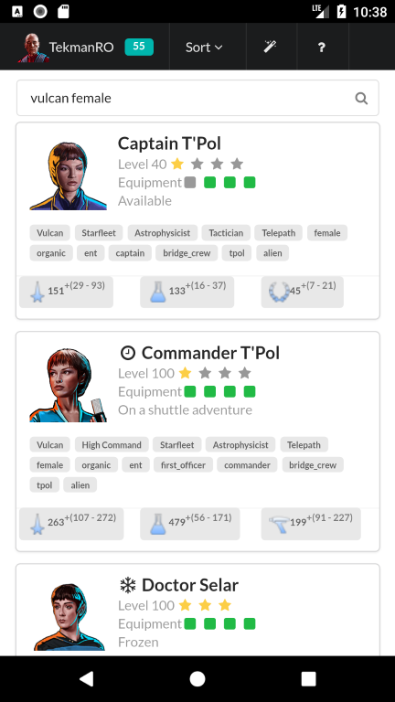
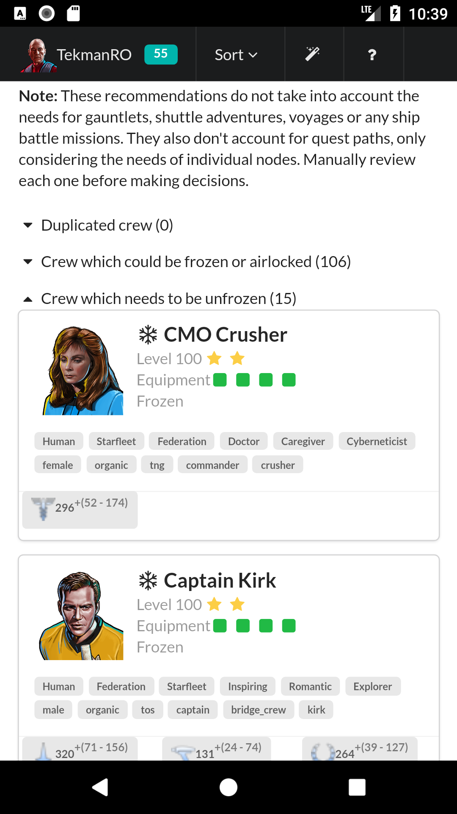
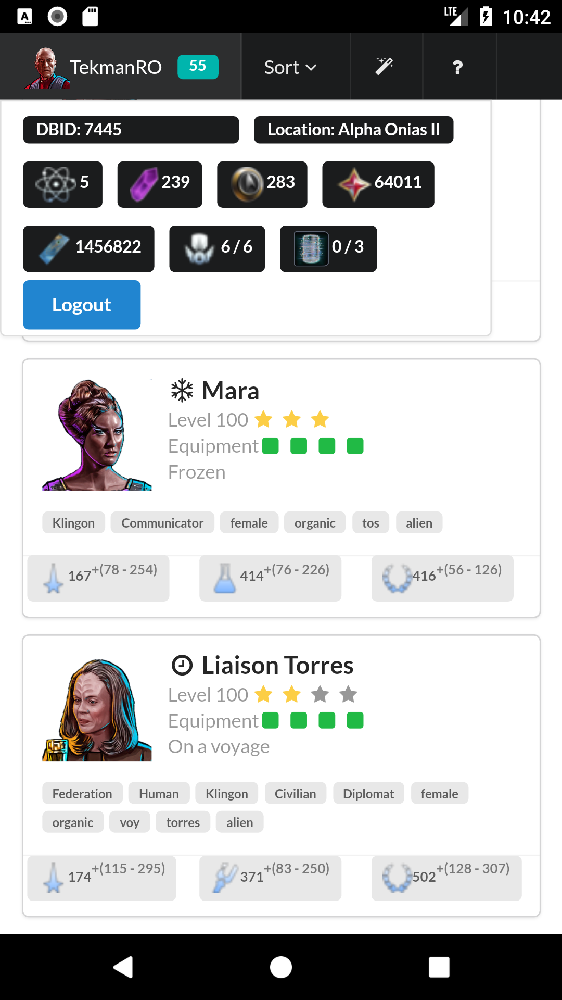

# Star Trek Timelines Mobile Companion

**NOTE** The mobile version is in a very early (pre-release) state. Same disclaimers apply as for the [desktop version](/README.md)!

## Features

### Crew management

The default tab lets you manage your crew. You can search using keywords matching names and / or traits.

You can also sort ascending / descending on various fields.

### Recommendations

The recommendations can help you choose which crew is safe to airlock or freeze and which crew is still needed to complete missions or cadet challenges. It also calls out duplicates you might have to help you get rid of newly aquired crew that you already maxed out.

### Stats

You can also quickly glance at your stats from the tool.

## Installation Steps

### Visual Studio Code
*(you will need node and npm installed before)*
- Install [VSCode](https://code.visualstudio.com/)
- (Optional: Install the VSCode [Cordova Extension](https://marketplace.visualstudio.com/items?itemName=vsmobile.cordova-tools) )
- From the command line run `npm install`
- From the command line run `npm run bundle`
- Add the cordova platform and run `cordova platform add browser`

At this point you'll need to make a change in platforms/browser/cordova/node_modules/cordova-serve/src/browser.js in order to be able to test locally: find "chromeArgs" and add this to the end: `'chrome': 'chrome --user-data-dir=%TEMP%\\' + dataDir + ' --disable-web-security',`

- To run the app in the browser `cordova run -target chrome`
