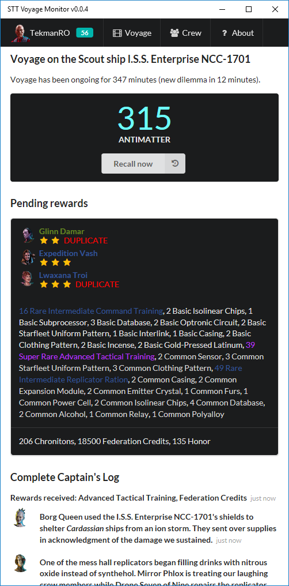
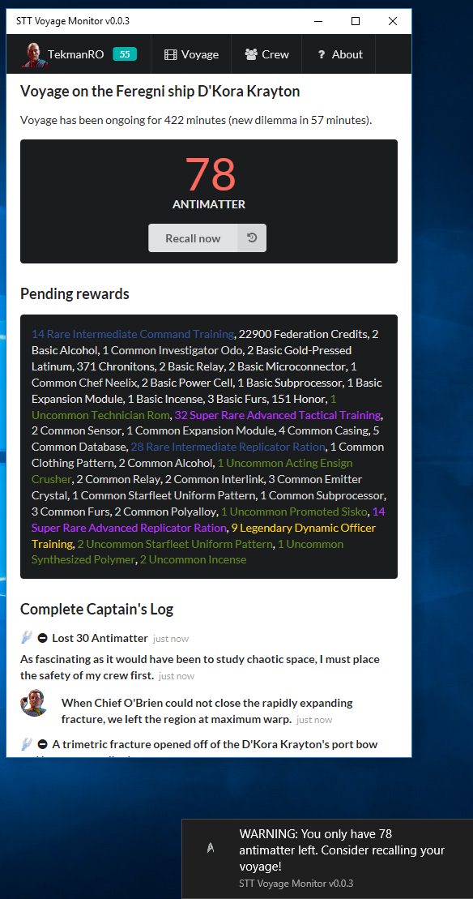
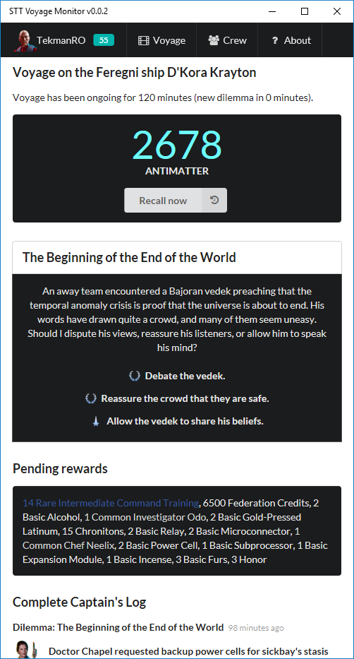
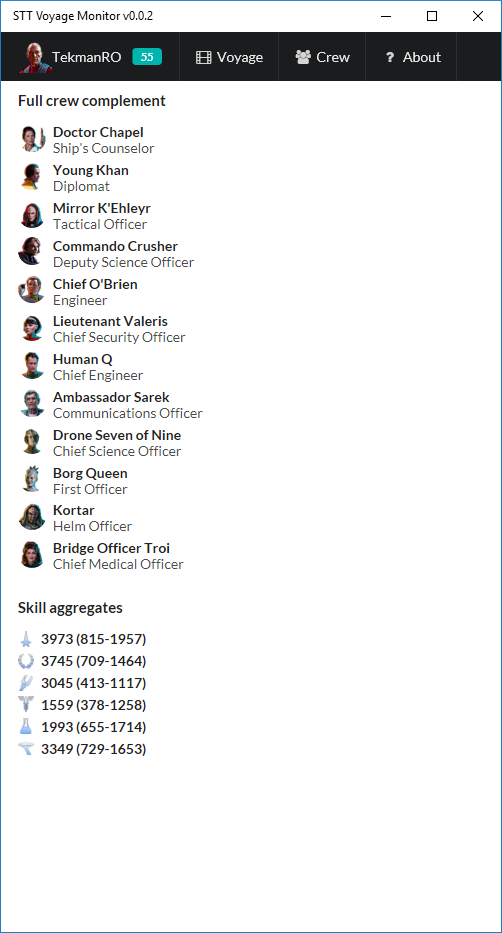

# Star Trek Timelines Voyage Monitor

**NOTE** This tool is in a very early (pre-release) state. Same disclaimers apply as for the [desktop version](/README.md)!

Latest release (if you don't want to build it yourself) is available [here](https://github.com/IAmPicard/StarTrekTimelinesSpreadsheet/releases/tag/v0.0.2-voyage).

## Features

### Monitor the captain's log and current voyage status

This is the main tab. It updates whenever a new event happens (every 20 seconds).

The program also displays a notification when antimatter drops below 100. You can choose to recall the voyage at any time from this tab.

When a dilemma is available, a notification will be displayed and you can choose a resolution from within the tool itself.

When the voyage is on its way back (recalled) you can export the log of your voyage (either as plain text or in JSON format).

### Crew

The second tab simply displays the list of crew assigned to the voyage with their respective roles and a skill aggregate table.

## Installation Steps

### Visual Studio Code
*(you will need node and npm installed before)*
- Install [VSCode](https://code.visualstudio.com/)
- (Optional: Install the VSCode [Cordova Extension](https://marketplace.visualstudio.com/items?itemName=vsmobile.cordova-tools) )
- From the command line run `npm install`
- From the command line run `npm run bundle`
- Add the cordova platform `cordova platform add windows`
- To build the app `cordova build windows`
- And finally to and run the app `cordova run windows`

If you encounter any issues, see complete requirements on the [Cordova Windows Platform Guide page](https://cordova.apache.org/docs/en/latest/guide/platforms/win8/).

**NOTE** This tool may work on other platforms (sans the notification part), but I only tested it on Windows 10 Creators Update.
